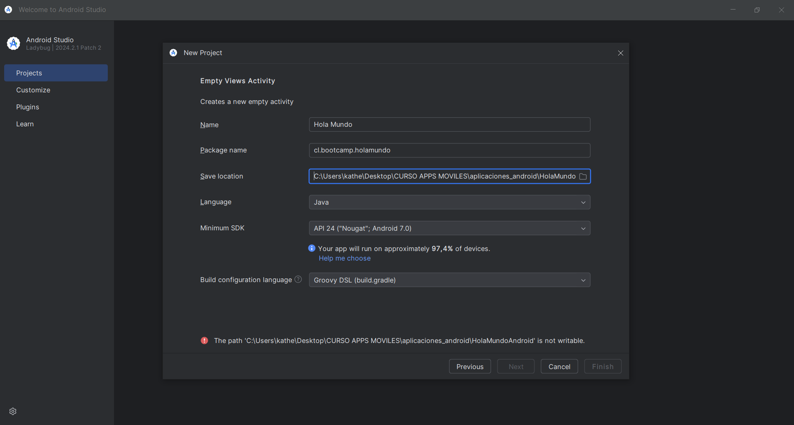
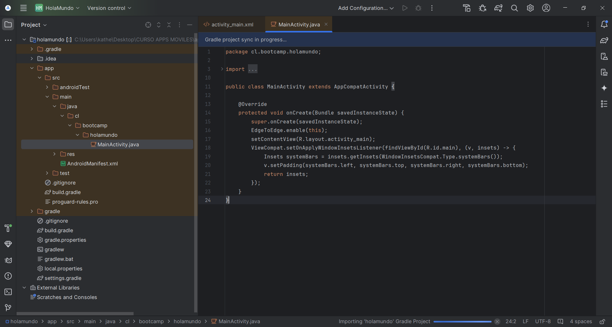
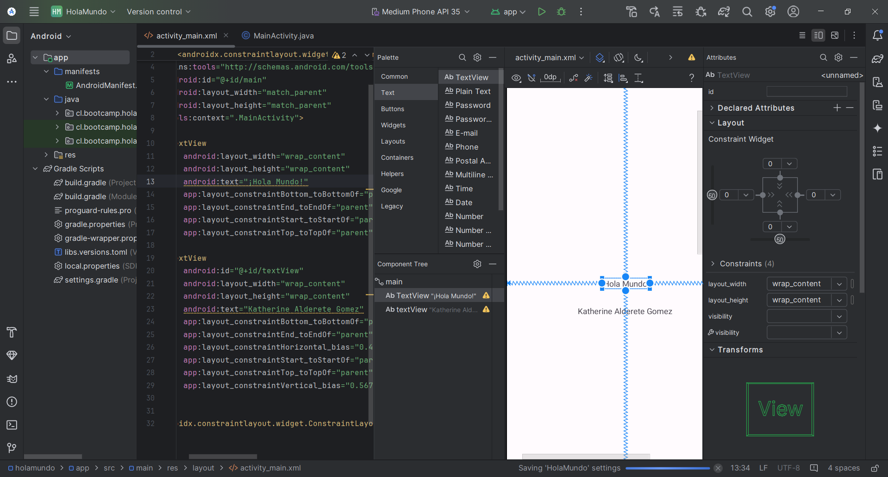
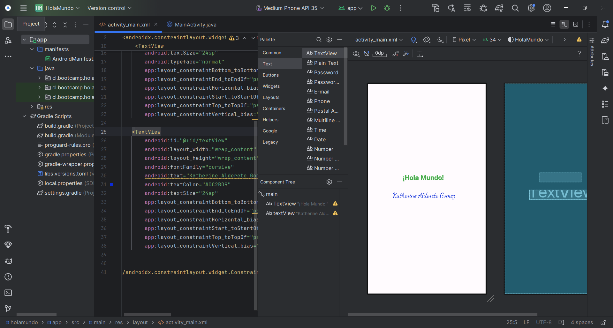
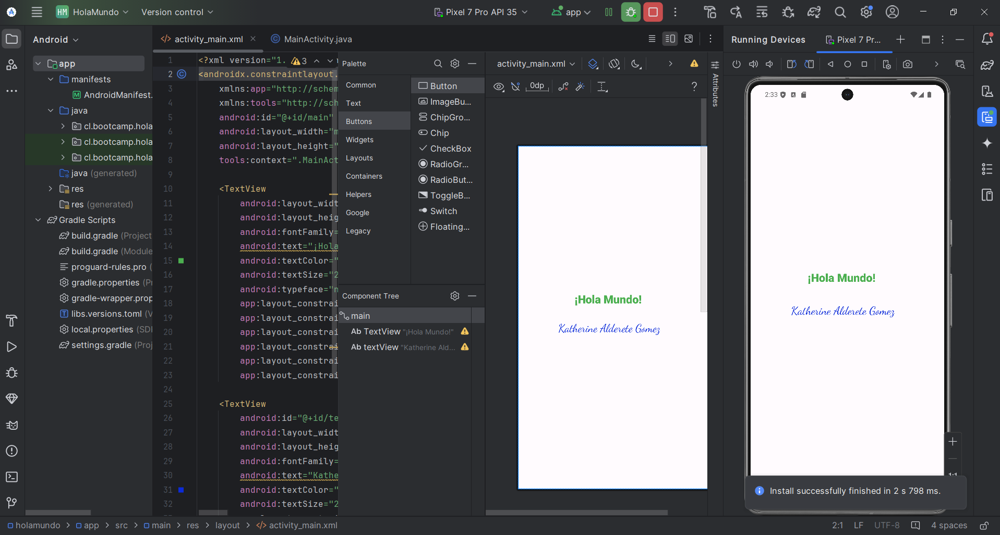
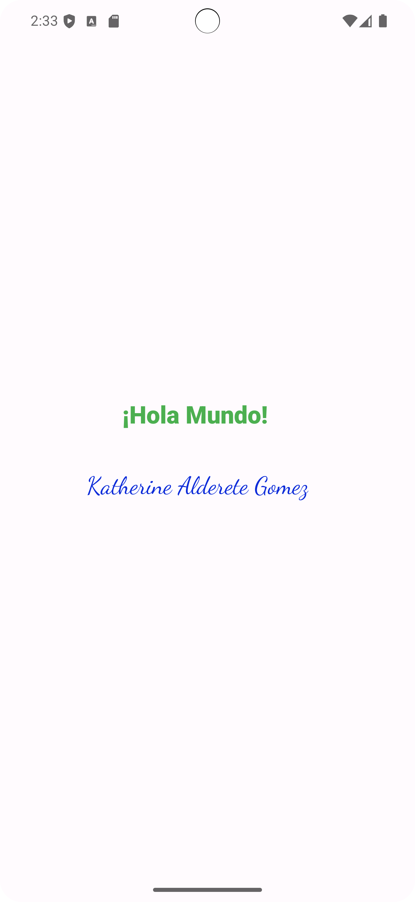

**_<h1 align="center">:vulcan_salute: Primer Hola Mundo en Android :computer:</h1>_**

Proyecto realizado según los siguientes requerimientos:

1. Debes crear un nuevo proyecto __respetando la configuración base__, ya que será la usada para todos los proyectos del módulo 4.
    - __Type Project:__ Empty Views Activity
    - __Lenguaje:__ Java
    - __Minimum SDK:__ API 24 ("Nougat", Android 7.0)
    - __Build config:__ Groovy DSL (build.gradle)

2. Modifica la vista principal de tal manera que se vean dos líneas de texto _(TextViews)_.
    - El primero debe indicar el saludo reglamentario de todo lenguaje de programación __"¡Hola Mundo!"__
    - Mientras que en el segundo agregarán su __Nombre y Apellido__.

3. Se recomienda agregar estilos para visualizar mucho mejor los textos. _(Opcional)_

4. El entregable consiste en un __archivo .zip__ que debe contener:
    - Capturas de imagen del proceso para crear un nuevo proyecto. __(Importante que se vea la configuración aplicada correctamente)__.
    - Captura del proyecto emulado. _Puede ser en un dispositivo virtual o físico_.

